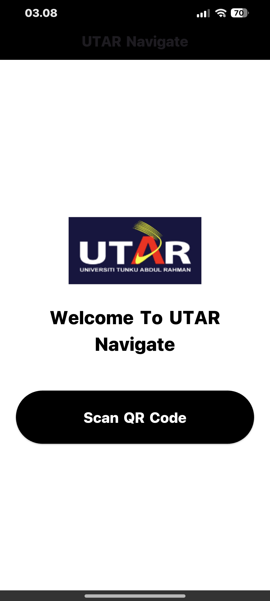
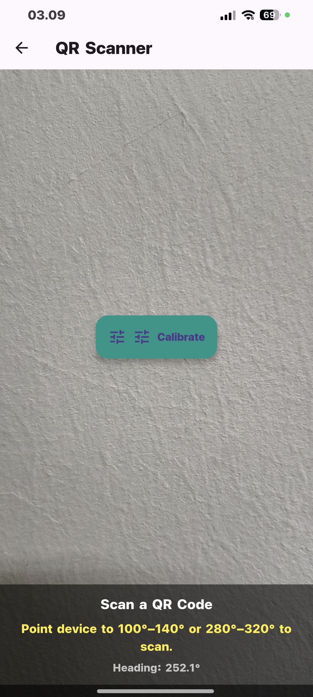
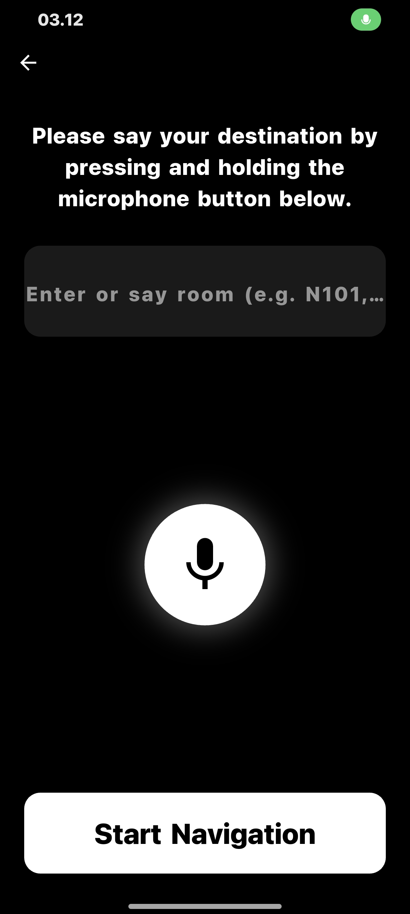
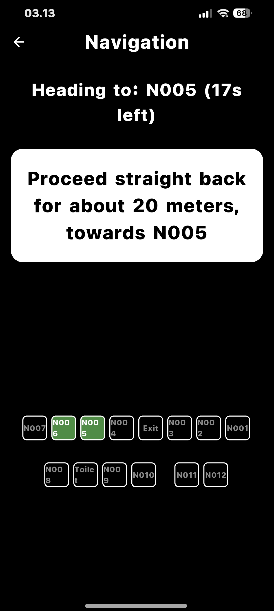

# UTAR Navigate 📍

**UTAR Navigate** is an accessible indoor navigation application built with Flutter. It helps Visually Impaired users navigate complex indoor environments (specifically UTAR campus rooms N001–N012) using QR code localization, sensor fusion for orientation, and voice-guided turn-by-turn directions.

The app is designed with high accessibility in mind, featuring high-contrast UI, large text, and full Text-to-Speech (TTS) and Speech-to-Text (STT) integration.

## ✨ Key Features

* **📍 QR Code Localization:** Instantly determine your starting position by scanning location markers.
* **🗣️ Voice Control:**
    * **Input:** Users can speak their destination (e.g., "N005", "Toilet", "Exit") using the microphone.
    * **Output:** The app announces directions, room confirmations, and navigation instructions aloud.
* **🧭 Advanced Compass & Sensor Fusion:** Uses the **Madgwick AHRS algorithm** to fuse accelerometer, gyroscope, and magnetometer data for accurate heading estimation.
* **🧩 Graph-Based Pathfinding:** Implements **Dijkstra’s Algorithm** to calculate the shortest path between rooms.
* **♿ Accessibility First:** Optimized for visually impaired users with a high-contrast (Black/White) interface and continuous audio feedback.
* **🔄 Smart Orientation Checks:** Detects if the user is facing the wrong way before scanning or starting navigation (e.g., "Please Turn Around First").

## 📱 Screenshots

| Home Page | QR Scanner | Voice Input | Navigation |
|:---:|:---:|:---:|:---:|
|  |  |  |  |


## 🛠️ Tech Stack

* **Framework:** [Flutter](https://flutter.dev/) (Dart)
* **State Management:** `setState` (Native)
* **Key Libraries:**
    * `mobile_scanner`: For reading QR location markers.
    * `flutter_tts`: For text-to-speech audio guidance.
    * `speech_to_text`: For voice command input.
    * `sensors_plus`: For accessing accelerometer, gyroscope, and magnetometer.
    * `shared_preferences`: For saving calibration data.
    * `permission_handler`: For managing camera and microphone permissions.

## 🚀 How to Run

1.  **Clone the repository:**
    ```bash
    git clone https://github.com/Wilsonowi/Indoor-Navigation-App.git
    cd utar-navigate
    ```

2.  **Install dependencies:**
    ```bash
    flutter pub get
    ```

3.  **Run on a physical device:**
    * *Note: This app relies heavily on hardware sensors (Compass/Camera), so it works best on a real Android/iOS device rather than an emulator.*
    ```bash
    flutter run
    ```

## 📂 Project Structure

* `lib/main.dart`: Entry point of the application.
* `lib/home_page.dart`: Main landing screen with large accessibility buttons.
* `lib/qr_scanner.dart`: Handles camera logic, Madgwick sensor fusion, and compass calibration.
* `lib/enter_room_page.dart`: Interface for voice/text input of the destination.
* `lib/indoor_navigation.dart`: Contains the graph data structure (Nodes/Edges) and Dijkstra's algorithm logic.
* `lib/navigation_page.dart`: The turn-by-turn navigation screen with a visual map and audio cues.

## 🤝 Contributing

Contributions are welcome! If you have suggestions for improving the sensor accuracy or adding new maps:
1.  Fork the Project.
2.  Create your Feature Branch (`git checkout -b feature/NewFeature`).
3.  Commit your Changes (`git commit -m 'Add some NewFeature'`).
4.  Push to the Branch (`git push origin feature/NewFeature`).
5.  Open a Pull Request.

## 📄 License

This project is open-source and available under the [MIT License](LICENSE).
